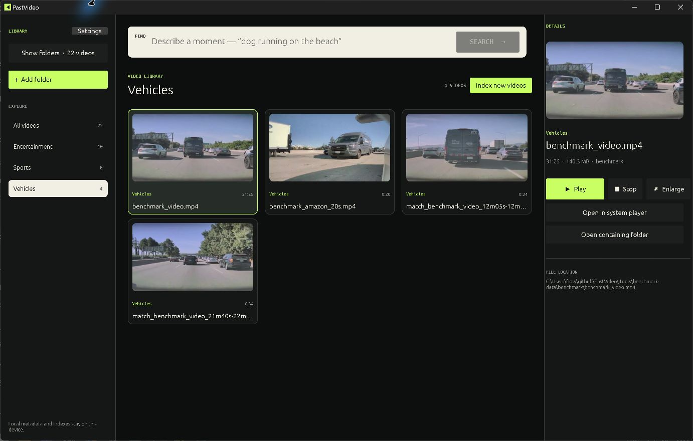
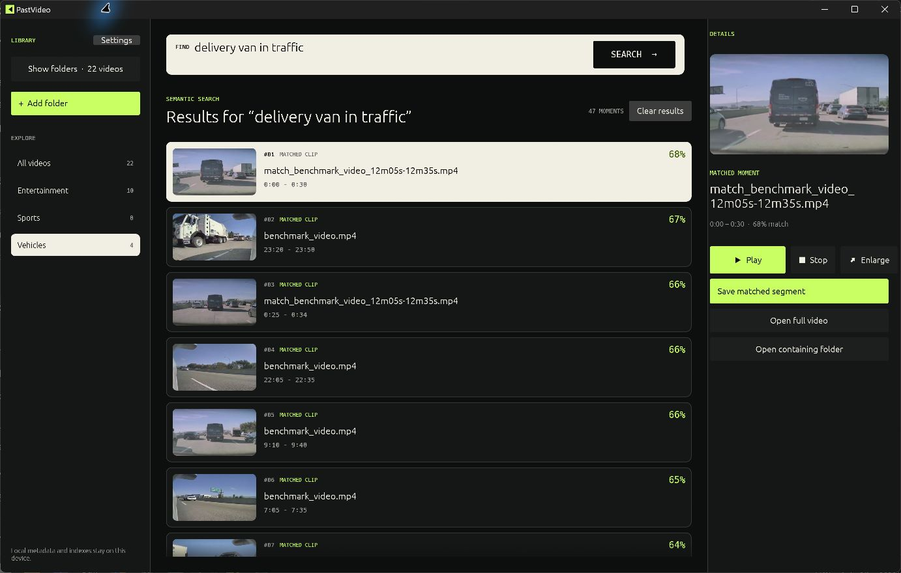
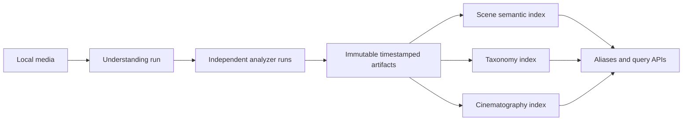

# PastVideo

**An open-source video database for indexing, searching, and exploring video libraries.**


PastVideo turns folders of video files into a searchable database. It scans one
or more folders, indexes moments inside each video, categorizes the library, and
lets you find footage with natural-language queries such as _“delivery van in
traffic”_ or _“a dog running on the beach.”_

The project is local-first: source videos, thumbnails, metadata, and indexes can
remain on your own machine. Local GPU indexing is used automatically when the
supported Qwen runtime is available, with CPU, remote-service, and Gemini options
for other environments.

## Why PastVideo?

Video files are usually stored as opaque files: the filename may be searchable,
but the content is not. PastVideo's objective is to provide an open foundation
for treating video as queryable data.

- Build a persistent database from existing folders without moving source files.
- Search indexed moments while the rest of the library is still being processed.
- See the exact matched frame, then play or seek through the complete video.
- Export a matched interval as a standalone MP4.
- Run as a native desktop application or as a headless server.
- Keep the storage, embedding provider, and deployment model under your control.

## Screenshots

### Browse and organize a local video library



### Search for moments inside videos



## Desktop and Server editions

PastVideo has two primary ways to run:

| Edition | Interface | Best for |
| --- | --- | --- |
| **PastVideo Desktop** | Native Windows GUI (`pastvideo-desktop`) | Personal libraries, visual browsing, playback, and matched-segment export |
| **PastVideo Server** | Headless CLI and HTTP API (`pastvideo`) | Servers, automation, integrations, and custom clients |

The desktop app is Windows-first; macOS support is planned. The core Rust
database, CLI, and server are designed without a GUI dependency. The repository
also contains an optional browser client in [`web/`](web/) for API demos and
remote deployments.

## Features

- Multiple library folders with add, remove, and collapsible folder management.
- Recursive scanning limited to supported video suffixes; MTS and M2TS are
  intentionally excluded.
- Automatic categories that update as each video finishes indexing.
- Natural-language and image-to-video semantic search.
- Optional local scene descriptions, screen-text OCR, and Whisper speech
  transcripts, fused with the visual index and shown as timestamped evidence.
- Search remains available during partial indexing and only considers completed
  indexed videos.
- Virtualized video grids and lazy thumbnail decoding for large libraries.
- Matched-frame thumbnails in search results and details.
- Shared playback controls for library items and search results, including
  play/pause, stop, seek, ±10 seconds, and a draggable timeline.
- Full-video playback from a matched timestamp rather than a restricted clip.
- GPU-backed matched-segment export on supported Windows systems, with safe CPU
  fallback.
- Local SQLite indexes isolated by embedding provider and model.
- Immutable, timestamped analyzer artifacts with model/configuration provenance.
- Multiple logical indexes and immutable physical versions projected from the
  same artifact without rerunning video understanding.
- Atomic index aliases for activation and rollback, plus structured filtering,
  sorting, aggregation, and semantic search.
- Range-enabled media streaming through the headless HTTP server.

## Quick start: Desktop (Windows)

Requirements:

- Rust with the stable toolchain
- Windows PowerShell
- FFmpeg on `PATH`, or a local build at `.tools\ffmpeg\bin`
- An NVIDIA GPU with about 8 GB or more free VRAM for the Qwen backend
  (optional; CPU mode is available)

Set up the reusable local Qwen environment once:

```powershell
.\scripts\setup_qwen.ps1
```

Run the native app:

```powershell
.\scripts\run_desktop.ps1
```

In the app:

1. Select **Add folder** and choose one or more video folders.
2. Select **Index new videos**. The button becomes **Stop indexing** while work
   is active.
3. Select **Understand content** to add local Caption, OCR, and Whisper evidence.
   Progress is committed after every video and the button becomes **Stop
   understanding** while active.
4. Search as soon as the first videos have finished indexing; understanding can
   continue in the background.
5. Select a video or search result to play it, reveal it in Explorer, or save the
   matched segment.

Build a portable Windows folder containing `PastVideo.exe` and FFmpeg tools:

```powershell
.\scripts\package_windows.ps1
```

The package is written to `.tools\release\PastVideo-win-x64`.

## Quick start: Server (headless)

Build the no-GUI server/CLI binary:

```powershell
cargo build --release --bin pastvideo
```

Index a directory and start the local HTTP API:

```powershell
.\target\release\pastvideo.exe --data-dir .tools\my-index --backend qwen index "D:\Videos"
.\target\release\pastvideo.exe --data-dir .tools\my-index --backend qwen serve --bind 127.0.0.1:8787
```

The server exposes:

| Method | Route | Purpose |
| --- | --- | --- |
| `GET` | `/api/status` | Index and service status |
| `GET` | `/api/videos` | Indexed videos |
| `POST` | `/api/search` | Natural-language search |
| `POST` | `/api/clip` | Save a matched interval |
| `GET` | `/api/media/{id}` | Range-enabled source video streaming |

The API binds to localhost by default and does not include authentication. Add
an authenticated reverse proxy before exposing it to another machine or the
public internet.

To run the optional browser client and local API together:

```powershell
.\scripts\run_web.ps1
```

## Command-line usage

```powershell
# Create visual, Caption, OCR, Whisper, and fused text indexes locally
.\target\release\pastvideo.exe --data-dir .tools\my-index --backend qwen enhance "D:\Videos"

# Search indexed footage
.\target\release\pastvideo.exe --data-dir .tools\my-index --backend qwen search "black SUV"

# Search with an image
.\target\release\pastvideo.exe --data-dir .tools\my-index --backend qwen img .\query.jpg

# Inspect or reset an index
.\target\release\pastvideo.exe --data-dir .tools\my-index --backend qwen stats
.\target\release\pastvideo.exe --data-dir .tools\my-index --backend qwen reset
```

Run `pastvideo --help` or `pastvideo <command> --help` for the complete CLI.

The local Caption/OCR/Whisper implementation, measured throughput, real-folder
quality checks, failure recovery, and native UI validation are documented in
[`docs/MULTIMODAL_UNDERSTANDING_E2E_REPORT.md`](docs/MULTIMODAL_UNDERSTANDING_E2E_REPORT.md).

## Durable Understanding → Artifact → Index workflow

The original `index` command remains the fastest path from a folder to visual
search. The artifact-backed commands expose the model-independent database layer
for integrations that need reproducibility or several query schemas over the
same model output.

```powershell
# 1. Register a local file. The command returns a stable media ID as JSON.
pastvideo --data-dir .tools\knowledge media-add D:\Videos\example.mp4

# 2. Import completed local analyzer outputs as immutable timestamped artifacts.
pastvideo --data-dir .tools\knowledge understand MEDIA_ID .\analyzers.json `
  --idempotency-key example-v1

# Or run the installed local video embedding model and persist its vectors.
pastvideo --data-dir .tools\knowledge --backend qwen understand-video MEDIA_ID `
  --idempotency-key qwen-video-v1

# 3. Build independent projections from the returned artifact ID.
pastvideo --data-dir .tools\knowledge index-create ARTIFACT_ID .\scene-semantic.json
pastvideo --data-dir .tools\knowledge index-create ARTIFACT_ID .\scene-camera.json

# 4. Activate a physical version behind a stable alias and query it.
pastvideo --data-dir .tools\knowledge index-activate scene_current INDEX_VERSION_ID
pastvideo --data-dir .tools\knowledge index-search scene_current "red suitcase in a car"
pastvideo --data-dir .tools\knowledge index-query scene_current .\structured-query.json
pastvideo --data-dir .tools\knowledge index-aggregate scene_current setting
```

`analyzers.json` is an array of `AnalyzerOutput` objects. Each output identifies
the analyzer/model revision and contains records with `segment_id`, `start_ms`,
`end_ms`, `data`, and `metadata`. `index-create` accepts an
`IndexDefinitionSpec` JSON object declaring the artifact type and its semantic,
filter, aggregate, and sort fields. A video-embedding artifact can set
`source_embedding_field` to `embedding`; its physical indexes then reuse the
durable vectors without any new video inference. All inputs and media are local
files in the initial implementation.

Ready-to-edit manifests are provided in
[`examples/architecture/`](examples/architecture/).

Rows are copied into structured projections before embeddings are generated.
Completed artifacts and ready index versions are protected by SQLite
immutability triggers. Idempotency keys reuse identical understanding results,
and every Media → Understanding → Analyzer → Artifact → Index relationship is
recorded in the inspectable `derivations` table.

## Embedding backends

| Backend | Availability | Notes |
| --- | --- | --- |
| **Automatic local** | Desktop default | Uses local Qwen/CUDA when available and falls back to the lightweight local CPU backend |
| **Qwen3-VL** | Desktop and Server | Real multimodal embedding with `Qwen/Qwen3-VL-Embedding-2B`; video content stays local |
| **Local CPU** | Desktop and Server (`baseline`) | Offline and dependency-light; intended for testing and simple visual searches |
| **Remote service** | Desktop | Connects to a configurable embedding endpoint, including a GPU service on the same machine |
| **Gemini** | Desktop | Managed `gemini-embedding-2` provider; requires an API key |

Indexes are separated by provider and model so incompatible vector dimensions
cannot be mixed. Gemini API keys are kept in memory and are not written to the
preferences file.

## How it works



PastVideo separates expensive inference from durable model output and
rebuildable retrieval indexes. Changing semantic fields, filters, or an
embedding model builds a new physical version from the existing artifact; it
does not reopen the video or rerun its analyzer. Search results retain exact
timestamps and lineage back to the media, model revision, artifact, and index
version. Source videos are never copied into the database.

The desktop's direct folder-indexing path samples overlapping video moments,
creates multimodal embeddings, and publishes each completed video immediately.
It remains available alongside the durable artifact architecture.

The local Qwen pipeline uses batched CUDA inference. For 1080p and larger video,
it attempts sparse NVIDIA NVDEC sampling and GPU resizing before falling back to
FFmpeg or CPU decoding. UI progress is published after each completed video so
new categories and searchable candidates appear promptly.

## Supported video formats

MP4, MOV, M4V, MKV, AVI, WebM, WMV, MPG/MPEG, 3GP/3G2, FLV/F4V, OGV, and VOB.

Files without a supported video suffix are ignored. MTS and M2TS are excluded by
design.

## Library API

```rust
use pastvideo::{qwen_embedder, Database};

let db = Database::with_embedder(".pastvideo", qwen_embedder()?)?;
db.insert_video("footage/front-door.mp4")?;

let hits = db.search_text("a delivery van", 5, Some(0.98))?;
let saved_clip = db.trim(&hits[0], "clips")?;

# Ok::<(), pastvideo::Error>(())
```

`Database` provides the direct folder-to-search workflow. `KnowledgeDatabase`
provides media registration, idempotent understanding runs, immutable artifacts,
multi-index projection, aliases, structured queries, aggregates, and semantic
search.

## Local model configuration

The Windows setup script uses these defaults:

- Python: `%USERPROFILE%\.venvs\qwen3-vl-cu128\Scripts\python.exe`
- Model: `%USERPROFILE%\.cache\pastvideo\models\Qwen3-VL-Embedding-2B-modelscope`
- Worker: `python\qwen_worker.py`

Useful overrides:

- `PASTVIDEO_QWEN_PYTHON`, `PASTVIDEO_QWEN_MODEL`, `PASTVIDEO_QWEN_WORKER`
- `PASTVIDEO_QWEN_BATCH_SIZE` and `PASTVIDEO_QWEN_MAX_FRAMES`
- `PASTVIDEO_QWEN_TOTAL_PIXELS`
- `PASTVIDEO_QWEN_HW_DECODE=off`
- `PASTVIDEO_FFMPEG` and `PASTVIDEO_FFPROBE`

Batch size scales automatically with detected VRAM. The defaults favor indexing
speed while preserving enough visual information for retrieval.

## Project structure

```text
src/lib.rs                    Core database library
src/architecture.rs           Durable artifact and multi-index data model
src/bin/pastvideo.rs          Headless CLI and server entry point
src/bin/pastvideo_desktop.rs  Native desktop entry point
src/server.rs                 HTTP API and range-enabled media serving
src/desktop.rs                Native GUI and playback
python/qwen_worker.py         Local Qwen/CUDA embedding worker
web/                          Optional browser client
tests/                        End-to-end indexing and provider tests
```

## Development and verification

```powershell
cargo fmt -- --check
cargo clippy --all-targets -- -D warnings
cargo test --all-targets

Set-Location web
npm run lint
npm run build
```

The E2E suite covers folder scanning, partial-index search, safe cancellation,
matched-frame thumbnails, provider contracts, real FFmpeg clip generation, and
the complete local Media → Understanding → Artifact → multiple-index workflow
through both the Rust API and CLI.

## Benchmark

PastVideo includes a reproducible Qwen/CUDA benchmark based on the fixed video
and queries from [sentrysearch issue #68](https://github.com/ssrajadh/sentrysearch/issues/68):

```powershell
cargo run --release -- --data-dir .tools\benchmark-data benchmark `
  --output .tools\qwen-benchmark.md
```

## Roadmap

- Windows desktop packaging and performance hardening
- macOS desktop support
- Easier headless-server packaging and deployment
- More local embedding models and remote-provider adapters
- Richer metadata, collections, and duplicate detection

## Contributing

Issues and pull requests are welcome. Please include a focused test for behavior
changes and run the verification commands above before submitting a PR. Avoid
committing source media, generated indexes, downloaded models, API keys, or
other private library data.

## License

Apache-2.0.
